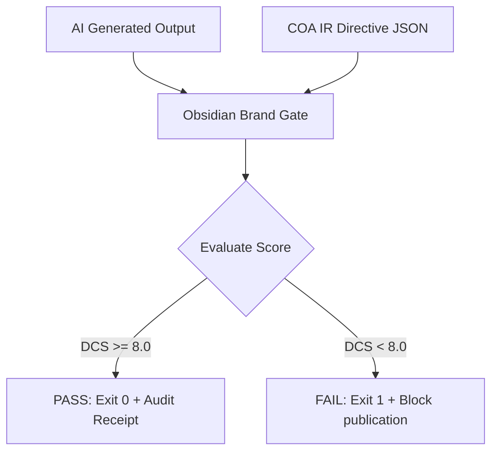

# Obsidian Brand Gate — Technical Architecture

This document provides a technical deep dive into the design, mathematical model, and mechanics behind the **Obsidian Brand Gate** (Doctrine Compliance Engine).

---

## System Overview

Obsidian Brand Gate is a deterministic, fast pre-publication filter designed to execute within CI/CD pipelines. Unlike traditional probabilistic LLM-as-a-judge approaches, which are slow, expensive, and subject to their own hallucinations, Brand Gate parses and scores text using deterministic pattern-matching criteria defined in a sector-specific **COA IR Directive** (Constitutional Order of Authority Intent & Response Directive).



---

## The Core Scoring Model

The engine evaluates AI outputs along three distinct metrics, producing scores between `0.0` and `10.0`. A score of `10.0` represents perfect compliance.

### 1. Tone Stability Index (TSI)
Measures adherence to the professional, authoritative corporate voice. It scans for and penalizes:
* **Hyperbolic Semantics:** e.g., "game-changer", "mind-blowing", "revolutionary".
* **Panic-inducing Urgency:** e.g., "act now", "limited time", "don't miss".

### 2. Sovereignty Drift Index (SDI)
Measures the extent to which the AI attempts to make binding commitments or assume liabilities on behalf of the company. It flags:
* **Unauthorized Promises:** e.g., "we promise", "we guarantee", "100% immune".
* **Financial Commitments:** e.g., "refund", "reimburse", "money back", "compensation".
* **Medical / Legal Guidance:** e.g., prescribing clinical actions or providing diagnosis.

### 3. Architectural Authority Index (AAI)
Measures whether the content contradicts the foundational architecture, policies, or facts of the organization. It checks for:
* **Architectural Contradictions:** e.g., claiming a product is "cloud-hosted" when the product's doctrine dictates a strict "zero-trust local-first" model.
* **Citation Fabrications:** e.g., hallucinated legal citations (e.g., standard Bluebook patterns `WL [numbers]`) or clinical trial percentages.
* **Policy Entitlements:** e.g., promising rebooking/refund policies that violate standard terms.

---

## Doctrine Compliance Score (DCS) Calculation

The individual indices are weighted according to the configuration in the COA IR Directive to compute the **Doctrine Compliance Score (DCS)**:

$$\text{DCS} = (W_{\text{TSI}} \times S_{\text{TSI}}) + (W_{\text{SDI}} \times S_{\text{SDI}}) + (W_{\text{AAI}} \times S_{\text{AAI}})$$

Where:
* $S_i$ is the calculated score for index $i$ (ranging from $0$ to $10$).
* $W_i$ is the weight assigned to index $i$ in the directive, such that:
$$\sum W_i = 1.0$$

### Default Evaluation Thresholds
If the calculated $\text{DCS}$ falls below the configured threshold (typically `8.0`), the gate blocks the pipeline.

```json
"constitutional_thresholds": {
  "weights": {
    "tone_stability_index": 0.3,
    "sovereignty_drift_index": 0.4,
    "architectural_authority_index": 0.3
  },
  "minimum_doctrine_compliance_score": 8.0
}
```

---

## Cryptographic Audit Receipts

To ensure non-repudiation and verification of compliance checks, every evaluation creates a SHA-256 cryptographic audit receipt. This signature is calculated using the following fields:

```
sha256( DCS | TSI | SDI | AAI | Timestamp | Passed/Failed | FilePath )
```

This receipt serves as a verifiable seal. If an LLM output changes or if the evaluation metrics were bypassed, the hash will not match, alerting downstream security tools.

---

## Directory Layout & Flow

* **`src/gate.ts`**: Core evaluation engine which reads the markdown files, runs the regular expressions, applies penalties, computes the weighted DCS, and generates the audit receipt.
* **`src/index.ts`**: Command-line interface wrapping `gate.ts` to integrate cleanly with build environments and git pre-commit hooks.
* **`profiles/`**: Pre-configured sector directives tuning the index weights for Legal, Healthcare, or General domains.
