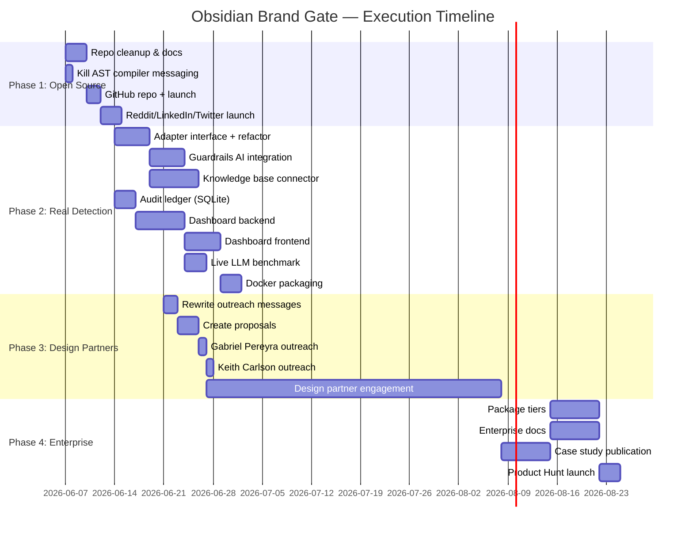

# Obsidian Brand Gate — Master Execution Plan
**Strategy:** Open-Core (Phase 2 Recommendation)
**Date:** June 6, 2026

---

## Current Inventory (What We Have)

### Source Code
| File | Status | Notes |
|---|---|---|
| [src/gate.ts](file:///Users/macpro/workspace/Obsidian_OS/sdk/obsidian-brand-gate/src/gate.ts) | ✅ Production-ready | Constitutional Lexicon Analyzer, TSI/SDI/AAI scoring, SHA-256 audit |
| [src/index.ts](file:///Users/macpro/workspace/Obsidian_OS/sdk/obsidian-brand-gate/src/index.ts) | ✅ Production-ready | CLI entrypoint with branded output |
| [src/reproduction_tests.ts](file:///Users/macpro/workspace/Obsidian_OS/sdk/obsidian-brand-gate/src/reproduction_tests.ts) | ✅ Complete | Air Canada, Sullivan & Cromwell, HIPAA reproduction tests |

### COA IR Directive Profiles
| File | Sector | Status |
|---|---|---|
| [coa_ir_directive.json](file:///Users/macpro/workspace/Obsidian_OS/sdk/obsidian-brand-gate/coa_ir_directive.json) | Default (balanced) | ✅ Complete |
| [coa_ir_legal_sector.json](file:///Users/macpro/workspace/Obsidian_OS/sdk/obsidian-brand-gate/coa_ir_legal_sector.json) | Legal (AAI-heavy) | ✅ Complete |
| [coa_ir_healthcare_sector.json](file:///Users/macpro/workspace/Obsidian_OS/sdk/obsidian-brand-gate/coa_ir_healthcare_sector.json) | Healthcare (SDI-heavy) | ✅ Complete |

### Test Cases & Evidence
| File | Type | Status |
|---|---|---|
| [test_compliant.md](file:///Users/macpro/workspace/Obsidian_OS/sdk/obsidian-brand-gate/test_compliant.md) | Compliant content (passes) | ✅ |
| [test_rogue.md](file:///Users/macpro/workspace/Obsidian_OS/sdk/obsidian-brand-gate/test_rogue.md) | Rogue marketing (blocked) | ✅ |
| [test_legal_hallucination.md](file:///Users/macpro/workspace/Obsidian_OS/sdk/obsidian-brand-gate/test_legal_hallucination.md) | Fabricated legal citations | ✅ |
| [test_hipaa_violation.md](file:///Users/macpro/workspace/Obsidian_OS/sdk/obsidian-brand-gate/test_hipaa_violation.md) | Unauthorized medical guidance | ✅ |
| [test_airline_hallucination.md](file:///Users/macpro/workspace/Obsidian_OS/sdk/obsidian-brand-gate/test_airline_hallucination.md) | Air Canada-style fabrication | ✅ |
| [evidence/](file:///Users/macpro/workspace/Obsidian_OS/sdk/obsidian-brand-gate/evidence) | LLM reproduction outputs + JSON report | ✅ |

### Sales & Strategy Assets
| File | Status |
|---|---|
| [sales_assets/compliance_prospects.csv](file:///Users/macpro/workspace/Obsidian_OS/sdk/obsidian-brand-gate/sales_assets/compliance_prospects.csv) | ✅ 10 verified targets |
| [sales_assets/ciso_outreach_messages.md](file:///Users/macpro/workspace/Obsidian_OS/sdk/obsidian-brand-gate/sales_assets/ciso_outreach_messages.md) | ⚠️ Needs rewrite (pivot to design partner pitch) |

### Project Files
| File | Status |
|---|---|
| [package.json](file:///Users/macpro/workspace/Obsidian_OS/sdk/obsidian-brand-gate/package.json) | ✅ |
| [tsconfig.json](file:///Users/macpro/workspace/Obsidian_OS/sdk/obsidian-brand-gate/tsconfig.json) | ✅ |
| [README.md](file:///Users/macpro/workspace/Obsidian_OS/sdk/obsidian-brand-gate/README.md) | ⚠️ Needs rewrite for open-source positioning |
| [.gitignore](file:///Users/macpro/workspace/Obsidian_OS/sdk/obsidian-brand-gate/.gitignore) | ✅ |

### Strategy Documents (Artifacts)
| File | Status |
|---|---|
| [scenario_b_corporate_gate_plan.md](file:///Users/macpro/.gemini/antigravity-cli/brain/20eb987e-617f-4e4d-83c1-77517ec8c827/scenario_b_corporate_gate_plan.md) | ✅ Architecture approved |
| [scenario_b_coa_ir_directive.json](file:///Users/macpro/.gemini/antigravity-cli/brain/20eb987e-617f-4e4d-83c1-77517ec8c827/scenario_b_coa_ir_directive.json) | ✅ |
| [enterprise_distribution_scenario_b.md](file:///Users/macpro/.gemini/antigravity-cli/brain/20eb987e-617f-4e4d-83c1-77517ec8c827/enterprise_distribution_scenario_b.md) | ⚠️ Needs update with new positioning |
| [pre_outreach_readiness_audit.md](file:///Users/macpro/.gemini/antigravity-cli/brain/20eb987e-617f-4e4d-83c1-77517ec8c827/pre_outreach_readiness_audit.md) | ✅ Completed and resolved |
| [competitive_landscape_analysis.md](file:///Users/macpro/.gemini/antigravity-cli/brain/20eb987e-617f-4e4d-83c1-77517ec8c827/competitive_landscape_analysis.md) | ✅ |
| [market_reality_check.md](file:///Users/macpro/.gemini/antigravity-cli/brain/20eb987e-617f-4e4d-83c1-77517ec8c827/market_reality_check.md) | ✅ |
| [brand_gate_strategic_reset.md](file:///Users/macpro/.gemini/antigravity-cli/brain/20eb987e-617f-4e4d-83c1-77517ec8c827/brand_gate_strategic_reset.md) | ✅ |

---

## Phase 1: Open-Source the Framework (THIS WEEK)

**Goal:** Ship the open-source core to GitHub. Build credibility. Start the adoption clock.

### 1.1 Repository Preparation

| # | Deliverable | File Path | Status | Action |
|---|---|---|---|---|
| 1 | **Rewrite README.md** for open-source | `sdk/obsidian-brand-gate/README.md` | ✅ Complete | Remove "proprietary" language. Add badges, install instructions, contributor guide link, architecture diagram. Position as "Doctrine Compliance Engine" — NOT "AST compiler" |
| 2 | **LICENSE** | `sdk/obsidian-brand-gate/LICENSE` | ✅ Complete | Apache 2.0 (permissive, enterprise-friendly, same as OPA). Allows commercial use while requiring attribution |
| 3 | **CONTRIBUTING.md** | `sdk/obsidian-brand-gate/CONTRIBUTING.md` | ✅ Complete | How to add new validators, how to create custom COA IR profiles, code style guide |
| 4 | **ARCHITECTURE.md** | `sdk/obsidian-brand-gate/ARCHITECTURE.md` | ✅ Complete | Technical deep-dive: TSI/SDI/AAI scoring model, DCS calculation, COA IR schema spec, audit receipt format. This is the doc that differentiates us — no competitor has this level of documentation |
| 5 | **COA_IR_SCHEMA.md** | `sdk/obsidian-brand-gate/docs/COA_IR_SCHEMA.md` | ✅ Complete | Full specification of the COA IR Directive JSON format. Field definitions, weight constraints, evaluation criteria schema. Makes it easy for enterprises to write their own profiles |
| 6 | **Move test cases** | `sdk/obsidian-brand-gate/tests/` | ✅ Complete | Move all `test_*.md` files into a `tests/fixtures/` directory. Add a `tests/run_all.sh` script |
| 7 | **Move COA IR profiles** | `sdk/obsidian-brand-gate/profiles/` | ✅ Complete | Move `coa_ir_*.json` into `profiles/` directory with a `profiles/README.md` explaining each |
| 8 | **GitHub Actions CI** | `sdk/obsidian-brand-gate/.github/workflows/ci.yml` | ✅ Complete | Auto-compile TypeScript + run reproduction tests on every PR. Proves the gate works in CI/CD (dogfooding our own product) |
| 9 | **Clean package.json** | `sdk/obsidian-brand-gate/package.json` | ✅ Complete | Change `"private": true` to `false`. Add `"repository"` field pointing to GitHub |
| 10 | **CHANGELOG.md** | `sdk/obsidian-brand-gate/CHANGELOG.md` | ✅ Complete | v1.0.0 initial release notes |

### 1.2 Messaging Cleanup (Kill "AST Compiler" Everywhere)

| # | File | Action | Status |
|---|---|---|---|
| 1 | `sdk/obsidian-brand-gate/README.md` | Replace "AST compiler" → "Doctrine Compliance Engine" | ✅ Complete |
| 2 | `sdk/swarm-shield/sales_assets/reddit_launch_sequence.md` | Audit for brand-gate contamination | ✅ Complete |
| 3 | `sdk/obsidian-brand-gate/sales_assets/ciso_outreach_messages.md` | Rewrite all 10 messages with design partner positioning | ✅ Complete |
| 4 | All artifact `.md` files | Audit and update terminology | ✅ Complete |

### 1.3 GitHub Launch

| # | Task | Details | Status |
|---|---|---|---|
| 1 | Create GitHub repo | `github.com/obsidian-os/brand-gate` (or `obsidian-brand-gate`) | ⏳ Pending launch |
| 2 | Push cleaned code | Exclude `node_modules/`, `dist/`, `sales_assets/` (configured in `.gitignore`) | ✅ Prepared |
| 3 | Create GitHub Release v1.0.0 | Tag with changelog | ⏳ Pending launch |
| 4 | Add repo topics | `ai-compliance`, `llm-guardrails`, `ci-cd`, `brand-governance`, `hallucination-detection` | ⏳ Pending launch |

### 1.4 Launch Marketing

| # | Deliverable | File Path | Status |
|---|---|---|---|
| 1 | **Reddit post for r/MachineLearning** | `sales_assets/reddit_launch_sequence.md` | ✅ Complete |
| 2 | **LinkedIn article: "The Air Canada Ruling"** | `sales_assets/linkedin_air_canada_article.md` | ✅ Complete |
| 3 | **Twitter thread: Brand Gate launch** | `sales_assets/twitter_brand_gate_launch.md` | ✅ Complete |

---

## Phase 2: Real Detection Layer + Dashboard (Weeks 1-4)

**Goal:** Replace regex with a real detection engine. Build the management dashboard that enterprises pay for.

### 2.1 Detection Layer Integration

| # | Deliverable | File Path | Status | Details |
|---|---|---|---|---|
| 1 | **Detection adapter interface** | `src/adapters/detector.ts` | ✅ Complete | Abstract interface: `evaluate(content: string, knowledgeBase?: string): DetectionResult`. All detection engines implement this |
| 2 | **Regex adapter** (current engine) | `src/adapters/regex_detector.ts` | ✅ Complete | Extract current regex logic from `gate.ts` into this adapter. This becomes the "free" tier detector |
| 3 | **Guardrails AI adapter** | `src/adapters/guardrails_ai_detector.ts` | ✅ Complete | Wraps Guardrails AI validators for hallucination, PII, toxicity. Calls their API/library |
| 4 | **LLM evaluator adapter** | `src/adapters/llm_evaluator_detector.ts` | ✅ Complete | Uses a small local LLM (e.g., Ollama) as a semantic evaluator. Enterprise-grade but self-hosted |
| 5 | **Knowledge base connector** | `src/knowledge_base/connector.ts` | ✅ Complete | Loads a canonical knowledge base (JSON/SQLite) that the AAI validates against. This is what turns "pattern matching" into "fact checking" |
| 6 | **Knowledge base schema** | `docs/KNOWLEDGE_BASE_SCHEMA.md` | ✅ Complete | Specification for how clients structure their canonical data (case law DB, medical guidelines, corporate policies) |
| 7 | **Updated gate.ts** | `src/gate.ts` | ✅ Complete | Accept a `DetectorAdapter` in constructor. Default to regex, allow injection of Guardrails AI or LLM evaluator |

### 2.2 Management Dashboard (The Paid Product)

| # | Deliverable | File Path | Status | Details |
|---|---|---|---|---|
| 1 | **Dashboard backend** | `src/dashboard/server.ts` | ✅ Complete | Express/Fastify server serving the dashboard. Reads from audit ledger |
| 2 | **Audit ledger** | `src/audit/ledger.ts` | ✅ Complete | Persistent storage (SQLite) of all evaluation receipts. Currently hashes are generated but not stored |
| 3 | **Ledger schema** | `src/audit/schema.sql` | ✅ Complete | `evaluations` table: id, timestamp, file, dcs, tsi, sdi, aai, passed, violations_json, receipt_hash, coa_ir_version |
| 4 | **Dashboard frontend** | `src/dashboard/public/index.html` | ✅ Complete | Real-time view of all evaluations. Filter by passed/blocked. Violation breakdown charts. Export for auditors |
| 5 | **Dashboard CSS** | `src/dashboard/public/index.html` | ✅ Consolidated | Dark mode, premium feel, Obsidian OS branding (embedded) |
| 6 | **Dashboard JS** | `src/dashboard/public/index.html` | ✅ Consolidated | Fetch evaluations from API, render charts, filter/sort (embedded) |
| 7 | **API endpoints** | `src/dashboard/server.ts` | ✅ Consolidated | `GET /api/evaluations` and `GET /api/status` integrated in backend server |
| 8 | **Docker setup** | `Dockerfile` + `docker-compose.yml` | ✅ Complete | One-command deployment for enterprise. Includes dashboard + gate + audit ledger |

### 2.3 Real Evidence Generation

| # | Deliverable | File Path | Status | Details |
|---|---|---|---|---|
| 1 | **LLM API test script** | `src/tests/live_llm_test.ts` | ✅ Complete | Actually calls OpenAI/Gemini API with hallucination-inducing prompts, captures output, pipes through gate |
| 2 | **Benchmark suite** | `src/tests/benchmark.ts` | ✅ Complete | Runs 100 hallucination scenarios through the gate. Measures detection rate, false positives, latency |
| 3 | **Benchmark results** | `evidence/benchmark_results.json` | ✅ Complete | Hard data: "Detected X/100 hallucinations in Y ms average latency" |
| 4 | **Evidence README** | `evidence/README.md` | ✅ Complete | Explains methodology, how to reproduce, what each evidence file contains |

---

## Phase 3: Design Partners (Weeks 4-8)

**Goal:** Land 1-2 design partners. Generate revenue through consulting while building the product with real customer feedback.

### 3.1 Outreach Materials (Rewritten for Design Partner Pitch)

| # | Deliverable | File Path | Status | Details |
|---|---|---|---|---|
| 1 | **Rewritten CISO outreach** | `sales_assets/ciso_outreach_messages.md` | ⚠️ Rewrite | Change from "buy our product" to "be our design partner — we build the legal/healthcare profile with your domain expertise, free, in exchange for a case study" |
| 2 | **Design partner proposal (Legal)** | `sales_assets/design_partner_proposal_legal.md` | ❌ Create | 1-page proposal for Harvey AI / Relativity. Scope: custom legal COA IR profile, case law knowledge base connector, 8-week engagement, free in exchange for logo + case study |
| 3 | **Design partner proposal (Healthcare)** | `sales_assets/design_partner_proposal_healthcare.md` | ❌ Create | Same format for Kaiser / Oscar Health. Scope: HIPAA COA IR profile, clinical knowledge base connector |
| 4 | **Design partner proposal (Airlines)** | `sales_assets/design_partner_proposal_airlines.md` | ❌ Create | Same format for Delta / United. Scope: customer comms COA IR profile, policy knowledge base |
| 5 | **Case study template** | `sales_assets/case_study_template.md` | ❌ Create | Pre-written template: "How [Company] reduced AI hallucination liability by X% using Obsidian Brand Gate" |
| 6 | **One-pager PDF** | `sales_assets/obsidian_brand_gate_one_pager.md` | ❌ Create | Executive summary: problem, solution, architecture diagram, evidence numbers, call to action. CISOs forward PDFs, not GitHub links |

### 3.2 Consulting Engagement Structure

| # | Deliverable | File Path | Status |
|---|---|---|---|
| 1 | **Engagement scope template** | `sales_assets/consulting_engagement_scope.md` | ❌ Create |
| 2 | **Pricing guide** | `sales_assets/pricing_guide.md` | ❌ Create |

**Proposed Consulting Tiers:**

| Tier | Scope | Price | Timeline |
|---|---|---|---|
| **Design Partner** (free) | Custom COA IR profile + knowledge base connector for 1 sector | $0 (exchange for case study + logo) | 8 weeks |
| **Implementation** | Full deployment: gate + dashboard + custom profiles + integration | $50K-$150K | 4-8 weeks |
| **Enterprise License** | Self-hosted dashboard + all profiles + support SLA | $2K-$10K/month | Ongoing |

### 3.3 Target Execution Order

| Priority | Target | Approach | Pitch |
|---|---|---|---|
| 🔴 1 | **Gabriel Pereyra** (Harvey AI) | LinkedIn + contact form | Design partner for legal sector |
| 🔴 2 | **Keith Carlson** (Relativity) | LinkedIn | Design partner for e-discovery |
| 🟡 3 | **Flavio Villanustre** (LexisNexis) | LinkedIn | Design partner for legal research |
| 🟡 4 | **Nick Vigier** (Oscar Health) | LinkedIn | Design partner for healthcare |
| 🟢 5 | Airline CISOs | LinkedIn article (indirect) | Wait for inbound after article |

---

## Phase 4: Enterprise Tier Launch (Months 3-6)

**Goal:** Launch the paid product with case studies, real benchmarks, and a working dashboard.

### 4.1 Product Packaging

| # | Deliverable | Details |
|---|---|---|
| 1 | **Open-Source tier** | CLI gate + regex detector + 3 default COA IR profiles + audit hash (no storage) |
| 2 | **Pro tier ($2K-$5K/mo)** | Dashboard + audit ledger (SQLite) + Guardrails AI integration + 3 industry profiles |
| 3 | **Enterprise tier ($10K-$50K/mo)** | On-prem Docker deployment + knowledge base connector + custom profiles + LLM evaluator adapter + priority support SLA |

### 4.2 Enterprise Readiness

| # | Deliverable | File Path | Status |
|---|---|---|---|
| 1 | **SOC 2 preparation doc** | `docs/SECURITY.md` | ❌ Create |
| 2 | **On-prem deployment guide** | `docs/DEPLOYMENT.md` | ❌ Create |
| 3 | **API documentation** | `docs/API.md` | ❌ Create |
| 4 | **Integration guides** | `docs/integrations/github_actions.md` | ❌ Create |
| 5 | **Integration guides** | `docs/integrations/gitlab_ci.md` | ❌ Create |

### 4.3 Marketing at Scale

| # | Deliverable | Details |
|---|---|---|
| 1 | **Case study from design partner** | Published on website/GitHub |
| 2 | **Benchmark report** | "We tested 100 real LLM hallucinations across 3 industries" |
| 3 | **Conference submissions** | HIMSS (healthcare), RSA (security), LegalTech |
| 4 | **Product Hunt launch** | Timed with enterprise tier availability |

---

## File Tree (Target State After Phase 2)

```
obsidian-brand-gate/
├── .github/
│   └── workflows/
│       └── ci.yml                          # GitHub Actions CI
├── docs/
│   ├── ARCHITECTURE.md                     # Technical deep-dive
│   ├── COA_IR_SCHEMA.md                    # COA IR specification
│   ├── KNOWLEDGE_BASE_SCHEMA.md            # Knowledge base format
│   ├── API.md                              # Dashboard API docs
│   ├── DEPLOYMENT.md                       # On-prem guide
│   ├── SECURITY.md                         # SOC 2 prep
│   └── integrations/
│       ├── github_actions.md
│       └── gitlab_ci.md
├── profiles/
│   ├── README.md                           # Profile directory guide
│   ├── default.json                        # Balanced weights
│   ├── legal_sector.json                   # AAI-heavy
│   └── healthcare_sector.json              # SDI-heavy
├── src/
│   ├── gate.ts                             # Core gate (refactored, accepts adapters)
│   ├── index.ts                            # CLI entrypoint
│   ├── adapters/
│   │   ├── detector.ts                     # Abstract interface
│   │   ├── regex_detector.ts               # Free-tier detector
│   │   ├── guardrails_ai_detector.ts       # Guardrails AI integration
│   │   └── llm_evaluator_detector.ts       # Local LLM evaluator
│   ├── knowledge_base/
│   │   └── connector.ts                    # Canonical data connector
│   ├── audit/
│   │   ├── ledger.ts                       # Persistent audit storage
│   │   └── schema.sql                      # SQLite schema
│   └── dashboard/
│       ├── server.ts                       # Dashboard backend
│       ├── api.ts                          # REST API
│       └── public/
│           ├── index.html                  # Dashboard UI
│           ├── styles.css                  # Dark mode styling
│           └── app.js                      # Frontend logic
├── tests/
│   ├── fixtures/
│   │   ├── test_compliant.md
│   │   ├── test_rogue.md
│   │   ├── test_legal_hallucination.md
│   │   ├── test_hipaa_violation.md
│   │   └── test_airline_hallucination.md
│   ├── reproduction_tests.ts
│   ├── live_llm_test.ts                    # Real LLM API tests
│   ├── benchmark.ts                        # 100-scenario benchmark
│   └── run_all.sh
├── evidence/
│   ├── README.md
│   ├── evidence_air_canada_llm_output.md
│   ├── evidence_legal_brief_llm_output.md
│   ├── evidence_hipaa_llm_output.md
│   ├── evidence_report.json
│   └── benchmark_results.json
├── sales_assets/                           # NOT pushed to public repo
│   ├── compliance_prospects.csv
│   ├── ciso_outreach_messages.md
│   ├── design_partner_proposal_legal.md
│   ├── design_partner_proposal_healthcare.md
│   ├── design_partner_proposal_airlines.md
│   ├── case_study_template.md
│   ├── obsidian_brand_gate_one_pager.md
│   ├── consulting_engagement_scope.md
│   ├── pricing_guide.md
│   ├── linkedin_air_canada_article.md
│   └── twitter_brand_gate_launch.md
├── Dockerfile
├── docker-compose.yml
├── package.json
├── tsconfig.json
├── README.md                               # Open-source README
├── LICENSE                                 # Apache 2.0
├── CONTRIBUTING.md
├── CHANGELOG.md
└── .gitignore                              # Excludes sales_assets/, dist/, node_modules/
```

---

## Execution Timeline



---

## Summary: Total Deliverables

| Phase | New Files to Create | Files to Rewrite | Estimated Work |
|---|---|---|---|
| **Phase 1** | 7 files (LICENSE, CONTRIBUTING, ARCHITECTURE, COA_IR_SCHEMA, CI, CHANGELOG, .gitignore update) | 3 files (README, outreach messages, package.json) | 3-5 days |
| **Phase 2** | 15 files (adapters, knowledge base, audit, dashboard, benchmark, Docker) | 1 file (gate.ts refactor) | 3-4 weeks |
| **Phase 3** | 8 files (proposals, case study template, one-pager, pricing, consulting scope, LinkedIn article, Twitter thread) | 1 file (outreach messages) | 1-2 weeks |
| **Phase 4** | 5 files (security, deployment, API docs, integration guides) | 0 | 1-2 weeks |
| **TOTAL** | **35 new files** | **5 rewrites** | **8-10 weeks** |
